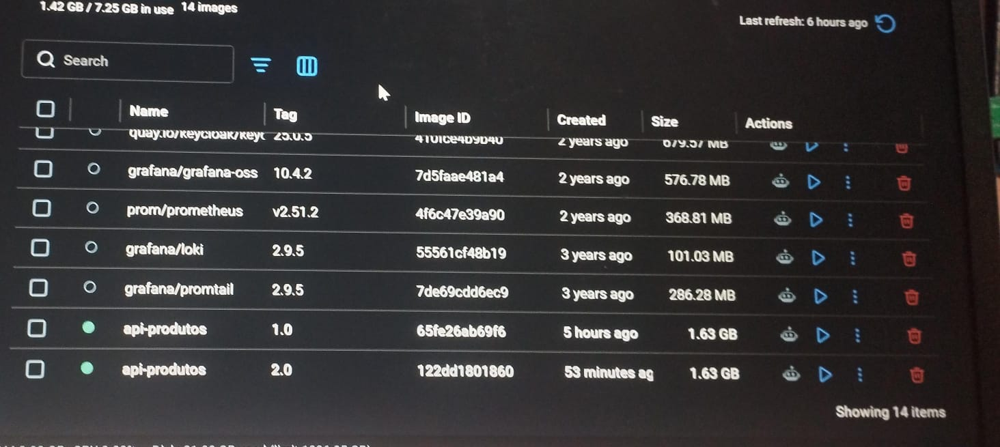
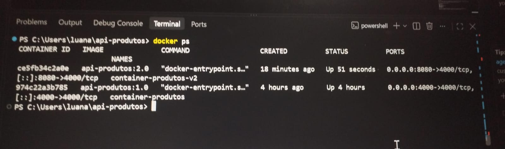
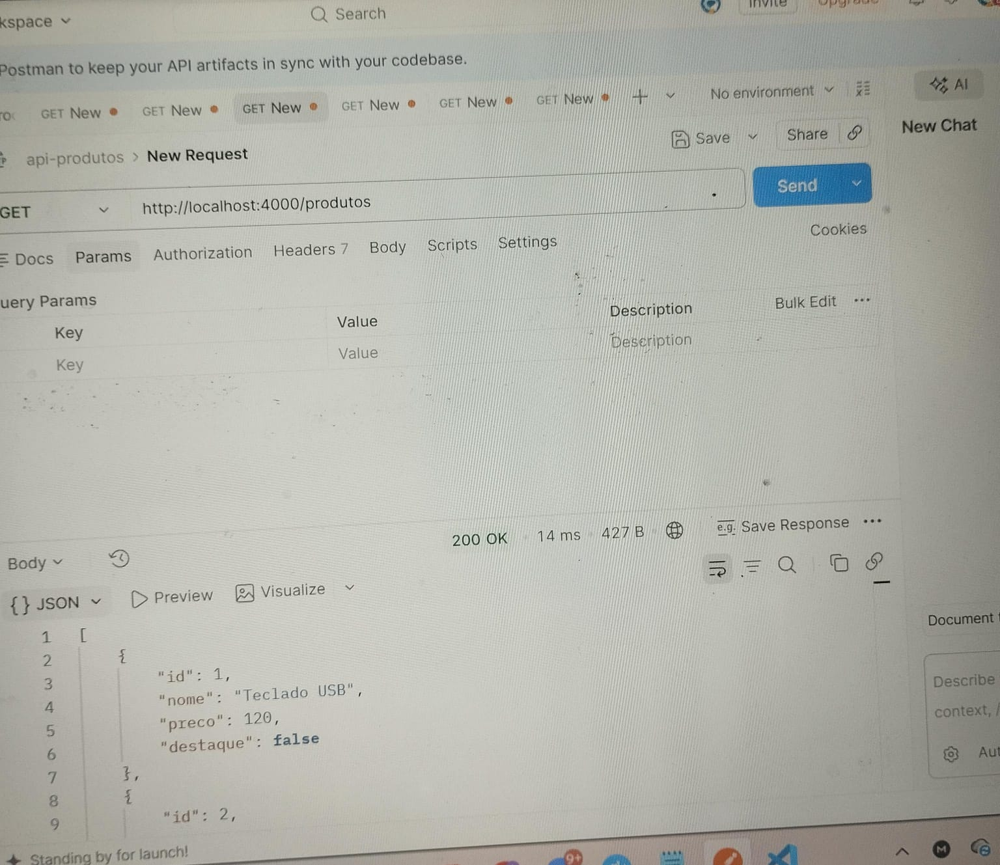
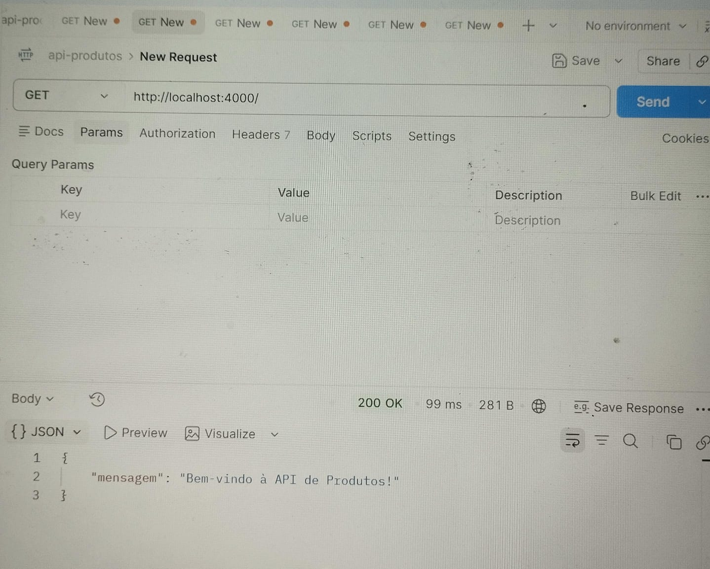
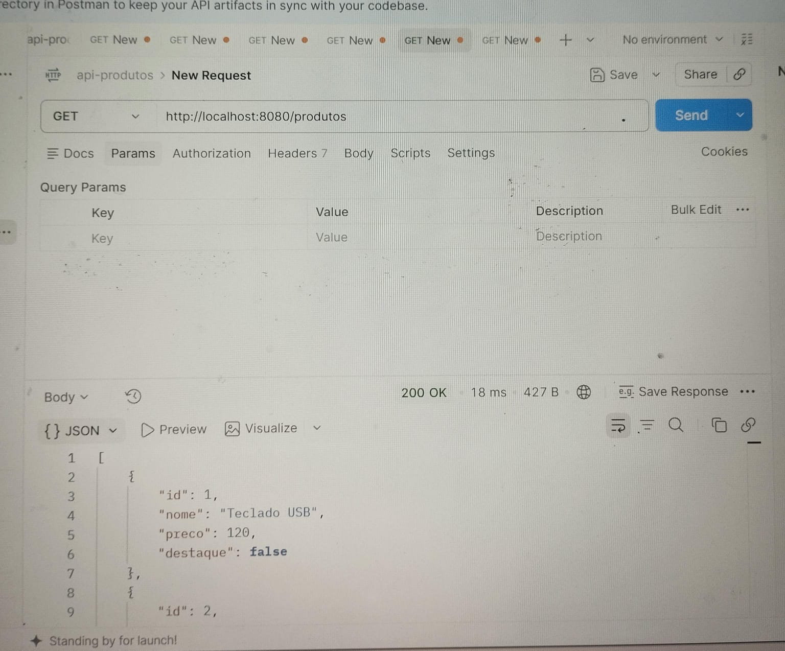
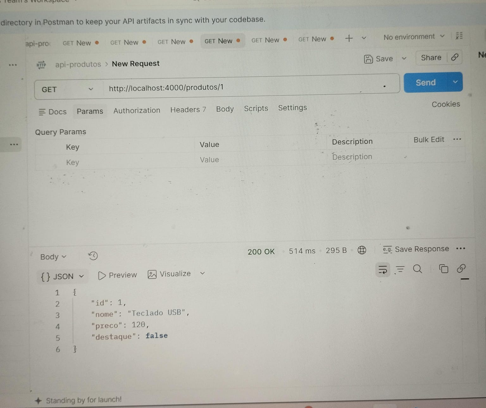
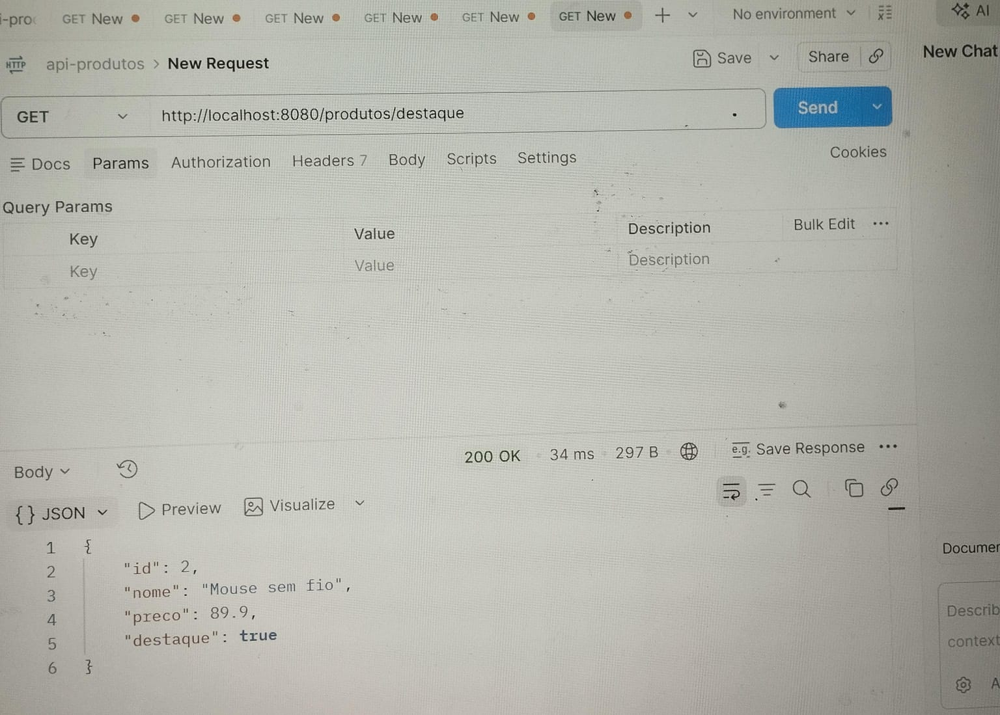

API de Produtos com Docker

Projeto desenvolvido para a atividade prática de Docker, com o objetivo de executar, versionar e testar uma API de produtos utilizando Node.js, Express e Docker.

Integrantes
Nome do integrante Edilucia
Nome do integrante Thiago
Nome do integrante Pedro
Nome do integrante Elissandra
Nome do integrante Luana

### 1. Investigação inicial do Projeto

Antes da criação do container, foi realizada uma análise dos arquivos do projeto para identificar a tecnologia utilizada, o arquivo principal, as dependências, a porta da aplicação e os endpoints disponíveis.

Tecnologia utilizada

A aplicação foi desenvolvida utilizando Node.js com o framework Express.js.

A utilização do Express pode ser identificada no arquivo server.js:

const express = require("express");
const app = express();

Além disso, o arquivo package.json possui o Express como dependência:

"dependencies": {
  "express": "4.21.2"
}
Arquivo principal

O arquivo principal da aplicação é o:

server.js

Essa informação também está definida no package.json, no script de inicialização:

"scripts": {
  "start": "node server.js"
}
Dependência necessária

A principal dependência utilizada pela aplicação é o Express, na versão 4.21.2.

O package-lock.json também registra essa dependência e suas informações de instalação.

Porta utilizada

A API utiliza a porta 4000.

Essa informação está definida no server.js:

const PORTA = 4000;

E o servidor é iniciado utilizando essa porta:

app.listen(PORTA, "0.0.0.0", () => {
  console.log(API de Produtos executando na porta ${PORTA});
});
Endpoints inicialmente disponíveis

Antes da alteração solicitada na atividade, a API possuía os seguintes endpoints:

Método	Endpoint	Função
GET	/	Exibe uma mensagem de boas-vindas
GET	/produtos	Retorna todos os produtos
GET	/produtos/:id	Retorna um produto específico pelo ID

### 2. Dockerfile

Foi criado um Dockerfile para preparar o ambiente necessário para executar a aplicação.

FROM node:22

WORKDIR /app

COPY package*.json ./

RUN npm install

COPY . .

EXPOSE 4000

CMD ["npm","start"]
Explicação das instruções
FROM node:22

Define a imagem base utilizada pelo container. Nesse caso, é utilizado o Node.js 22.

WORKDIR /app

Define o diretório /app como diretório de trabalho dentro do container.

COPY package*.json ./

Copia os arquivos package.json e package-lock.json para dentro do container.

Esses arquivos são necessários para identificar e instalar as dependências do projeto.

RUN npm install

Instala as dependências definidas no package.json, incluindo o Express.

COPY . .

Copia os demais arquivos do projeto para o diretório /app, incluindo o server.js.

EXPOSE 4000

Documenta que a aplicação utiliza a porta 4000 dentro do container.

Essa instrução não publica a porta diretamente para o computador. O acesso externo é definido posteriormente pelo comando docker run.

CMD ["npm","start"]

Define o comando executado quando o container é iniciado.

O comando utiliza o script start do package.json, que executa:

node server.js

### 3. Construção da imagem Docker

A primeira imagem da aplicação foi construída utilizando o nome api-produtos e a tag 1.0.

Comando utilizado:

docker build -t api-produtos:1.0 .

Para verificar a existência da imagem, foi utilizado:

docker images

A imagem api-produtos:1.0 representa uma versão empacotada da aplicação com o ambiente e as dependências necessárias para sua execução.

### 4. Execução inicial do container

A primeira versão da aplicação foi executada em um container chamado:

container-produtos

Comando utilizado:

docker run -d --name container-produtos -p 4000:4000 api-produtos:1.0

Nesse comando:

-d executa o container em segundo plano;
--name container-produtos define o nome do container;
-p 4000:4000 mapeia a porta 4000 do computador para a porta 4000 do container;
api-produtos:1.0 define a imagem utilizada.

Para verificar se o container estava em execução:

docker ps

### 5. Testes da API no Postman

A API foi testada utilizando o Postman.

GET /

URL:

http://localhost:4000/

Resultado esperado:

{
  "mensagem": "Bem-vindo à API de Produtos!"
}

Status esperado:

200 OK
GET /produtos

URL:

http://localhost:4000/produtos

Resultado esperado:

[
  {
    "id": 1,
    "nome": "Teclado USB",
    "preco": 120,
    "destaque": false
  },
  {
    "id": 2,
    "nome": "Mouse sem fio",
    "preco": 89.9,
    "destaque": true
  },
  {
    "id": 3,
    "nome": "Monitor 24 polegadas",
    "preco": 899,
    "destaque": false
  }
]

Status esperado:

200 OK
GET /produtos/1

URL:

http://localhost:4000/produtos/1

Resultado esperado:

{
  "id": 1,
  "nome": "Teclado USB",
  "preco": 120,
  "destaque": false
}

Status esperado:

200 OK

### 6. Alteração da aplicação — Produto em destaque

Foi adicionada uma nova funcionalidade à API para retornar o produto que possui a propriedade destaque definida como true.

Foi criado o endpoint:

GET /produtos/destaque

O código implementado foi:

app.get("/produtos/destaque", (req, res) => {
  const produto = produtos.find(item => item.destaque === true);

  if (!produto) {
    return res.status(404).json({
      erro: "Produto em destaque não encontrado"
    });
  }

  res.json(produto);
});

O endpoint foi colocado antes de /produtos/:id para que a palavra destaque não seja interpretada como um ID de produto.

O resultado esperado é:

{
  "id": 2,
  "nome": "Mouse sem fio",
  "preco": 89.9,
  "destaque": true
}

### 7. Teste da alteração no container antigo

Após modificar o arquivo server.js, foi realizado um teste utilizando o container antigo.

Foi utilizado:

http://localhost:4000/produtos/destaque

O novo endpoint não estava disponível no container antigo.

Isso ocorre porque alterar o arquivo server.js no computador não modifica automaticamente o código que já está dentro de um container existente.

O container foi criado a partir da imagem api-produtos:1.0, que continha a versão anterior do código.

Portanto, para que a alteração fosse incorporada à aplicação Dockerizada, foi necessário criar uma nova imagem.

### 8. Construção da versão 2.0

Após a alteração do código, foi criada uma nova versão da imagem:

docker build -t api-produtos:2.0 .

A versão 2.0 contém o código atualizado, incluindo o novo endpoint /produtos/destaque.

Por que foi necessário criar uma nova imagem?

As imagens Docker funcionam como versões empacotadas da aplicação.

Quando o código utilizado para criar uma imagem é alterado, a imagem existente não é modificada automaticamente.

Por isso, foi necessário executar um novo docker build para criar a imagem api-produtos:2.0.

### 9. Execução da versão 2.0

Para executar a nova versão, foi criado um novo container:

container-produtos-v2

Como a porta 4000 do computador já estava sendo utilizada pelo container da versão anterior, foi utilizada a porta externa 8080.

O comando utilizado foi:

docker run -d --name container-produtos-v2 -p 8080:4000 api-produtos:2.0

O mapeamento utilizado foi:

8080:4000

Isso significa:

8080 → porta do computador;
4000 → porta utilizada pela aplicação dentro do container.

### 10. Testes da versão 2.0

Com a nova versão em execução, os endpoints foram acessados pela porta 8080.

GET /produtos
http://localhost:8080/produtos

O endpoint continua funcionando normalmente, demonstrando que as funcionalidades anteriores foram preservadas.

GET /produtos/destaque
http://localhost:8080/produtos/destaque

Resultado esperado:

{
  "id": 2,
  "nome": "Mouse sem fio",
  "preco": 89.9,
  "destaque": true
}

## Evidências

### Etapa 3 — Imagem Docker

### Etapa 4 — Container em execução

### Etapa 5 — Testes no Postman

### Etapa 6 — Novo endpoint

### 11. Diferença entre porta do computador e porta do container

Na versão 2.0 foi utilizado o seguinte mapeamento:

8080:4000

A representação é:

COMPUTADOR                  CONTAINER

localhost:8080  ─────────→  porta 4000
                             API Node.js/Express

A porta 8080 é a porta utilizada para acessar a API pelo computador.

A porta 4000 continua sendo a porta utilizada pela aplicação dentro do container.

Por isso, não foi necessário alterar o código:

const PORTA = 4000;

Nem alterar:

EXPOSE 4000

Apenas foi alterado o mapeamento realizado no docker run.

### 12. Investigação dos containers

Para listar os containers que estavam em execução, foi utilizado:

docker ps

Para visualizar também os containers que estavam parados:

docker ps -a

### 13. Visualização dos logs

Para verificar o funcionamento da API e as mensagens produzidas pela aplicação, foi utilizado:

docker logs container-produtos-v2

Esse comando permite visualizar os registros gerados pelo container, incluindo a mensagem de inicialização da API.

### 14. Parar e iniciar o container

Para parar o container da versão 2.0:

docker stop container-produtos-v2

Depois, foi utilizado:

docker ps -a

para verificar que o container continuava existindo, porém com o status de parado.

O container foi iniciado novamente com:

docker start container-produtos-v2

E sua execução foi conferida novamente com:

docker ps

### 15. O que acontece quando o container é parado?

Quando o comando docker stop é utilizado, o container deixa de executar a aplicação, mas não é excluído.

Por isso, ele continua aparecendo no comando:

docker ps -a

Enquanto estiver parado, uma requisição feita para a API não será atendida, pois não haverá um processo do container escutando a porta publicada.

Depois de executar:

docker start container-produtos-v2

a aplicação volta a funcionar e as requisições podem ser realizadas novamente.

### 16. Diferença entre docker stop e docker rm
docker stop

Para a execução do container, mas mantém o container existente.

docker stop container-produtos-v2

O container pode ser iniciado novamente utilizando:

docker start container-produtos-v2
docker rm

Remove o container.

docker rm container-produtos-v2

Depois de removido, o container não poderá ser iniciado novamente com docker start. Nesse caso, será necessário criar outro container a partir de uma imagem.

### 17. Imagem x Container

Uma imagem Docker é um pacote que contém os elementos necessários para criar e executar uma aplicação, como o ambiente, dependências e código.

Um container é uma instância em execução ou parada criada a partir de uma imagem.

Neste projeto foram utilizadas as versões:

api-produtos:1.0
api-produtos:2.0

E os containers:

container-produtos
container-produtos-v2

A imagem pode ser utilizada para criar vários containers, enquanto cada container possui seu próprio estado de execução.

### 18. Dificuldade encontrada e solução

Durante a execução da atividade, ocorreu um conflito relacionado ao nome do container durante a criação da segunda versão.

O container container-produtos-v2 já existia. Além disso, foi inicialmente utilizado um mapeamento de porta diferente do definido posteriormente na atividade.

A situação foi investigada verificando os containers existentes com:

docker ps -a

O container que estava utilizando a configuração incorreta foi parado e removido:

docker stop container-produtos-v2
docker rm container-produtos-v2

Depois, ele foi recriado utilizando a configuração solicitada para a atividade:

docker run -d --name container-produtos-v2 -p 8080:4000 api-produtos:2.0

Essa situação permitiu compreender melhor a diferença entre o nome do container, a imagem utilizada e o mapeamento das portas.

### 19. Conclusão

A atividade permitiu compreender o processo de containerização de uma aplicação Node.js utilizando Docker.

Foi possível identificar a estrutura da API, criar um Dockerfile, construir imagens Docker, executar containers, realizar testes utilizando o Postman e criar uma nova versão da aplicação após uma alteração no código.

Também foi possível compreender que alterações realizadas no código local não são automaticamente refletidas em containers já existentes. Para incorporar uma alteração, é necessário construir uma nova imagem e executar um container utilizando essa nova versão.

Além disso, foi demonstrada a diferença entre a porta utilizada pela aplicação dentro do container e a porta utilizada pelo computador para acessar a API, utilizando o mapeamento 8080:4000.

Por fim, foram realizados procedimentos de investigação dos containers, visualização de logs, parada, verificação e inicialização novamente de um container.

### 20. Estrutura final do projeto

api-produtos/
│
├── server.js
├── package.json
├── package-lock.json
├── Dockerfile
├── README.md
├── api-produtos.postman_collection.json
│
└── imagens/
    ├── etapa3-imagem.png
    ├── etapa4-container.png
    ├── etapa5-postman.png
    └── etapa6-postman.png

O diretório node_modules não foi enviado para o repositório do GitHub, pois as dependências podem ser instaladas novamente utilizando o npm install.